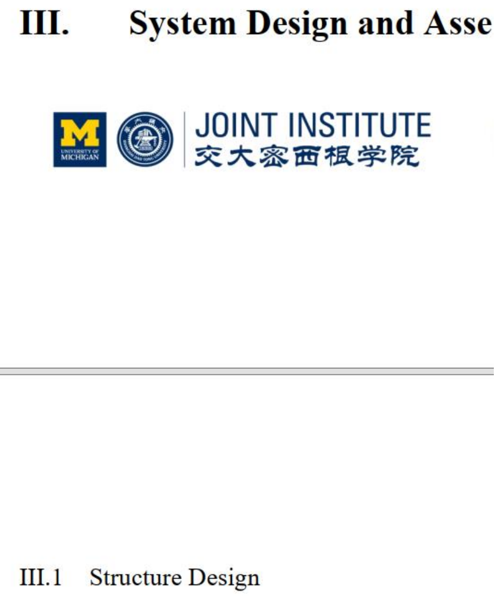

# ENGR1000J-S2 Report Guidance

这篇Guidance是为ENGR1000J-S2(syf/st section)报告写作指导而准备的。以下总结了常见的格式错误和扣分点，请认真阅读并确保你的报告格式正确。

## 基本要求

### 正文需两端对齐

- 正确示范：

  
### 每段开头不需要空格

- 错误示范：

  
### 标题不能与正文分在不同页，标题应与正文在同一页

- 错误示范：

### 图片题目结尾必须有句号

- 错误示范：

### 图题格式 (Fig.X &emsp; Caption)

- 错误示范：

## 字体

- **字号**：小标题字号应大于正文

- 错误示范：

- **图中文字**：所有图中的文字需与正文字体要求一致

## 间距

**常见错误**：

- **行距不一致**
错误示范：

- **段落间距不一致**
错误示范：

- **章节间距不一致**
错误示范：

- **标题与正文间距不一致**
错误示范：

- **图题/表题与正文间距不一致**
错误示范：

- **每一页文字底部与页脚间距不一致**
错误示范：

## 参考文献格式

- 参考文献应使用**9号字体**
- 请访问 [AIAA Journal Author Guidelines](https://www.aiaa.org/publications/journals/Journal-Author) 获取更多引用格式信息

## 备注

- 2025 Teaching Team 修正了word模板中长期以来存在的问题，包括所有
  - 段落标题与正文的间距错误，段落内、段落间的间距错误
  - 图/表标题题标点错误以及图/表标题与正文的间距错误
  - 参考文献的字体大小错误
- 2025 TC TA (陈泽奕、王欣畅)基于word模板创建了LaTeX模板，并附在此供大家使用。
  - [ENGR1000J-template](https://github.com/zicheng1744/ENGR1000J-template)
  - 由于LaTeX模板仍处于更新完善中，请在使用过程中把可能潜在的格式问题反馈给助教，我们会及时更新。

## Reference

Yu, Yanze, Xiao, Luyan, VG100 TC Lab-RPT1, 2024.
