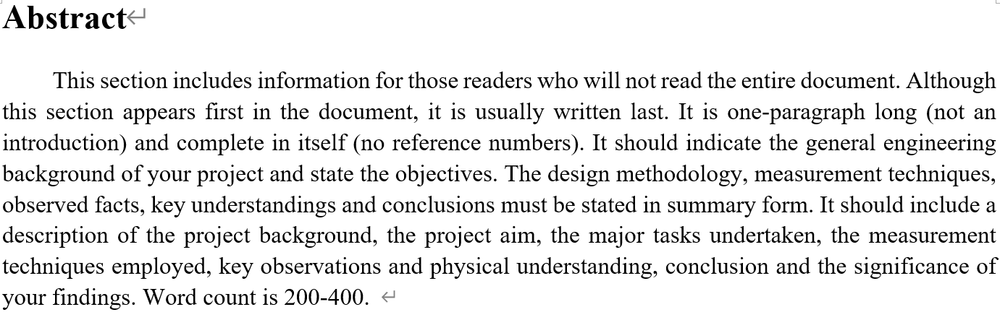
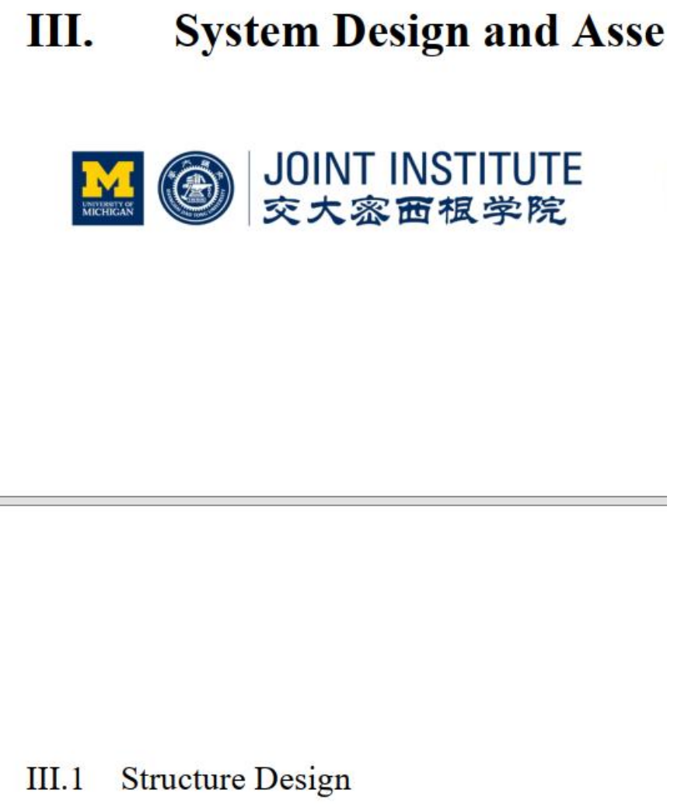
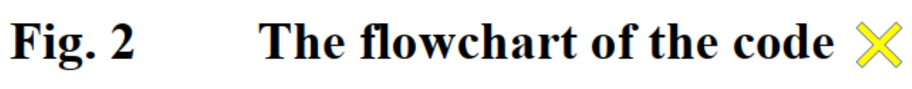
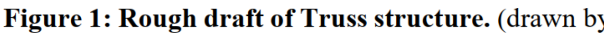
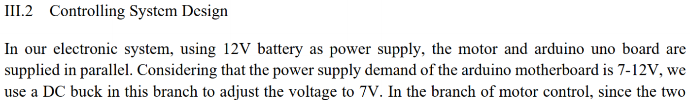
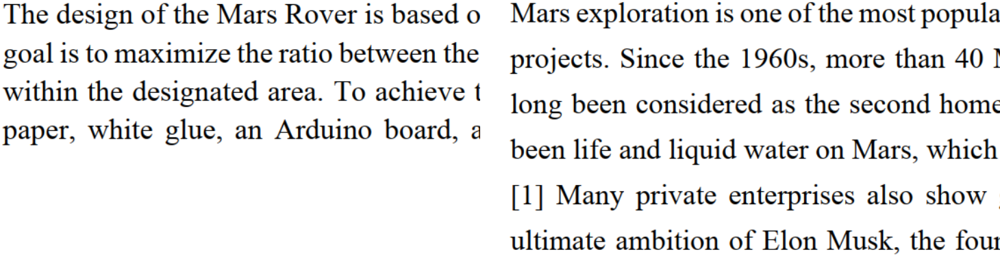
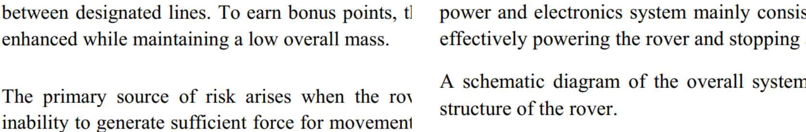
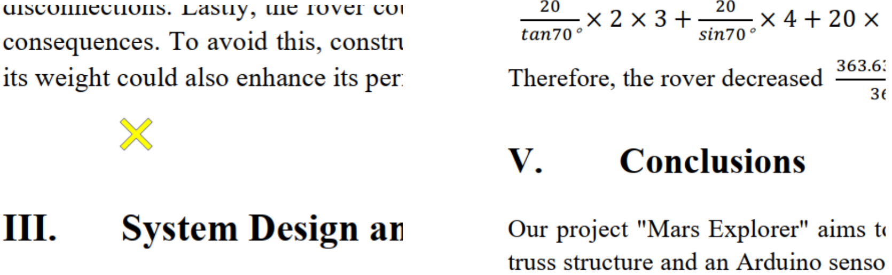
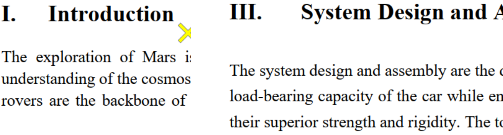
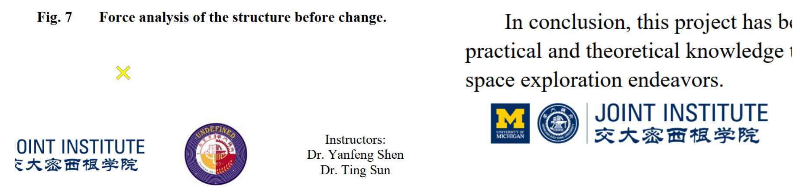

# ENGR1000J-S2 Report Guidance

This guidance is for ENGR1000J-S2 report writing. The following summarizes common formatting mistakes and point deductions. Please read carefully and ensure your report format is correct.

## Basic Requirements

### Body Text must be Justified

- Correct example:

  

### No Indent at the Beginning of Each Paragraph

- Incorrect example:

  

### Title and Body Text must be on the Same Page

- Incorrect example:

  

### Figure Caption must End with a Period

- Incorrect example:

  

### Figure Caption Format (Fig.X &emsp; Caption)

- Incorrect example:

  

## Font

- **Font Size**: Subtitle font size should be larger than the body text.

- Incorrect example:

  

- **Font in Figures**: All text in figures must follow the same font requirements as the body text.

## Spacing

**Common mistakes:**

- **Inconsistent line spacing**

  Incorrect example:

  
&nbsp;

- **Inconsistent paragraph spacing**

  Incorrect example:

  
&nbsp;

- **Inconsistent section spacing**

  Incorrect example:

  
&nbsp;

- **Inconsistent spacing between section titles and text**

  Incorrect example:

  
&nbsp;

- **Inconsistent spacing between bottom of the text and the footer**

  Incorrect example:

  

&nbsp;

## Reference Formatting

- References should use **9-point** font.
- Please visit [AIAA Journal Author Guidelines](https://www.aiaa.org/publications/journals/Journal-Author) for more information on citation format.

## Notes

- The 2025 Teaching Team has created a LaTeX template based on the Word template, visit [ENGR1000J-template](https://github.com/zicheng1744/ENGR1000J-template) for more information.
  - As the LaTeX template is still being updated, please report any potential formatting issues to the TAs for timely updates.

## Reference

Yu, Yanze, Xiao, Luyan, VG100 TC Lab-RPT1, 2024.
