# ENGR1000J-S2 Report Format Guide

这篇Guide总结了2025SU Phase1 report中常见的错误和扣分点，并明确了一系列使用$LaTeX$模板时的规范。

## Part 1: 基本要求

### 1. 正文需两端对齐

$LaTeX$：模板默认两端对齐，无需刻意调整

- 正确示范：

- 错误案例：

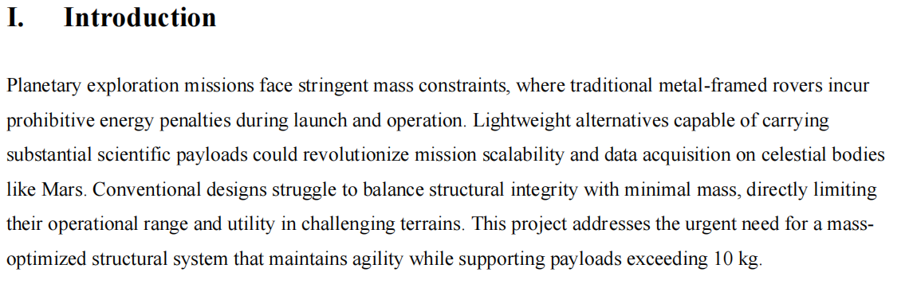
  
### 2. 脚注需与正文一致

$LaTeX$：第一页脚注需要在`engr1000j-s2.cls`文件中调整，后续脚注应直接标注在图表之后

- 错误案例：当正文没有出现 ${}^2$ 和 ${}^{*}$ 的时候在脚注标注 

 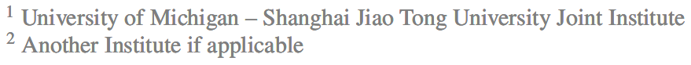

 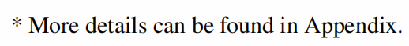

### 3. 不要把单独一个词留在一段的最后一行

- 错误案例：

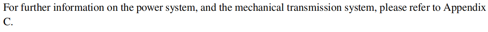

### 4. 不要把单独一行留到第二页

- 错误案例：

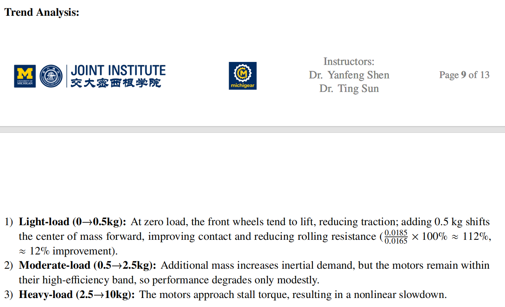

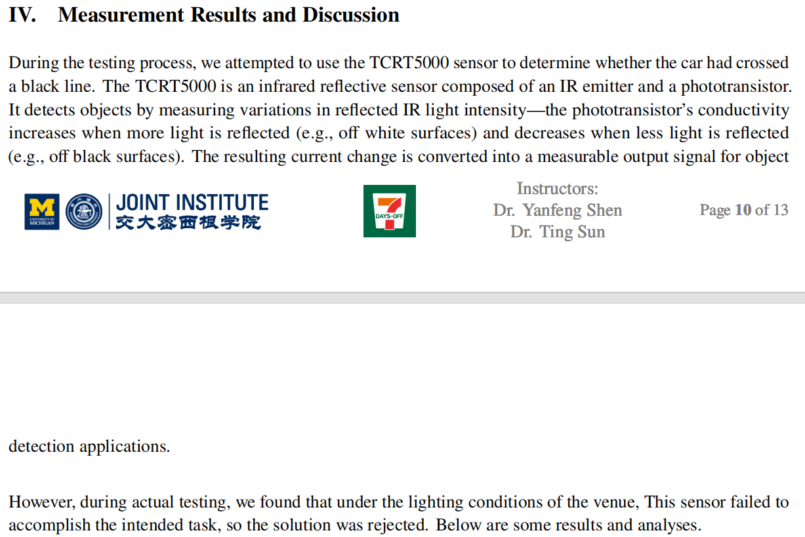

### 5. 页码需要和文章总页数对应

$LaTeX$：需要在`engr1000j-s2.cls`文件中调整

- 错误案例：
 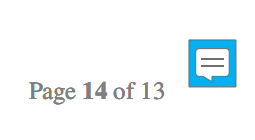

### 6. 不要在一页末尾留下大片空白

- 错误案例：

### 7. 不要连续插入图片和表格

- 一个图片和表格的前后都应该有文字说明，图表只是为了辅助正文的表达
- 如果迫不得已连续放置两张图（或表），它们之间应该有正常的空隙
- 允许：可以将图片或表格放在正文提到位置的前一页或者后一页
- 建议：图片推荐放在一页的上方，表格推荐放在一页的末尾
- 错误案例：

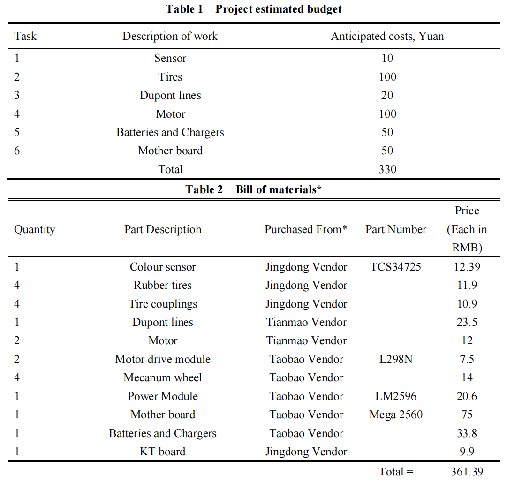

### 8. 分点表达要简洁

$LaTeX$：在每一个item的最后需要`\\`强制换行

- 使用item分点表达时，每一个点都只应该包含不超过一句完整的话
- 错误案例：

改正：使用`\subsection{}`

### 9. 所有图、表、公式和参考文献都需要引用

$LaTeX$：使用`ref{}`来引用图、表，用`\eqref{}`来引用公式，用`\cite{}`来引用Reference

- 在正文中，图片应该写作`Fig. X`，表格应该写作`Table X`，公式应该写作`Eq. (X)`
- 请注意数字和文字之间的空格
- 参考文献引用见后文

### 10. 所有引用和链接都应该正常工作

- 图表、公式、参考文献引用链接在最终提交版中应能正常工作
- 目录页的链接应能正常工作
- 参考文献处的URL或者DOI要能正常工作

---
## Part 2: 标题

### 1. 不推荐使用小标题
实际上，在这门课的report里，你几乎不需要用到小标题

$LaTeX$：如果你要使用小标题，请直接用`\subsection{}`,`\subsubsection{}`

- 正确示范：

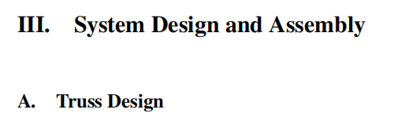
- 错误案例：

### 2. 不要使用item作为小标题

- 区分：小标题代表新的一块内容开始，分点表示一个
- 

---
## Part 3: 间距

### 1. 行距不一致

- 错误案例：

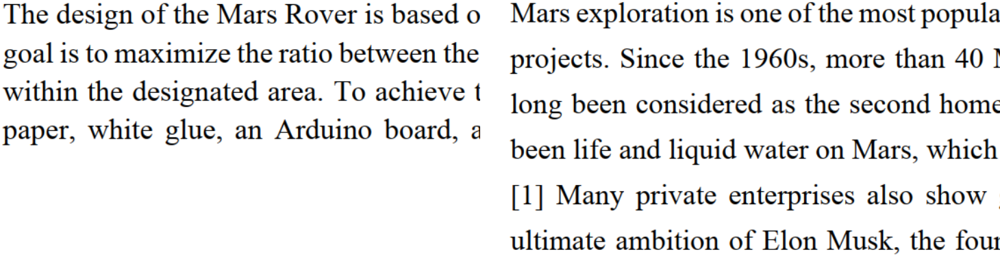

### 2. 段落间距不一致

- 错误案例：

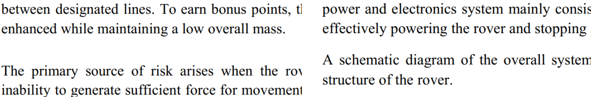

### 3. 章节间距不一致

- 错误案例：

### 4. 标题与正文间距不一致

- 错误案例：

### 5. 图题/表题与正文间距不一致

- 错误案例：

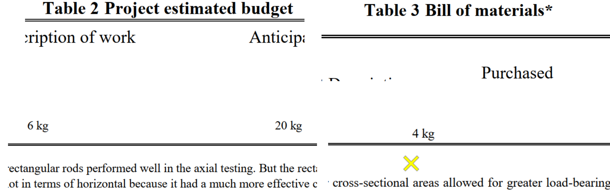

### 6. 每一页文字顶部与页眉间距不一致
 
 - 错误案例：

 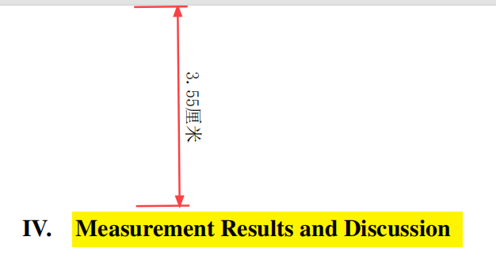
### 7. 每一页文字底部与页脚间距不一致

- 错误案例：

### 8. 公式与正文间距不一致

- 错误案例：

---
## Part 4: 图片

### 图片题目结尾必须有句号

- 错误案例：

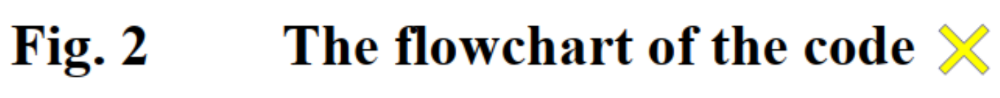

### 图题格式 (Fig.X &emsp; Caption)

- 错误案例：

---

## Part 5: 表格

---

## Part 6: Reference

### 1. 参考文献应使用**9号字体**

- 错误案例：

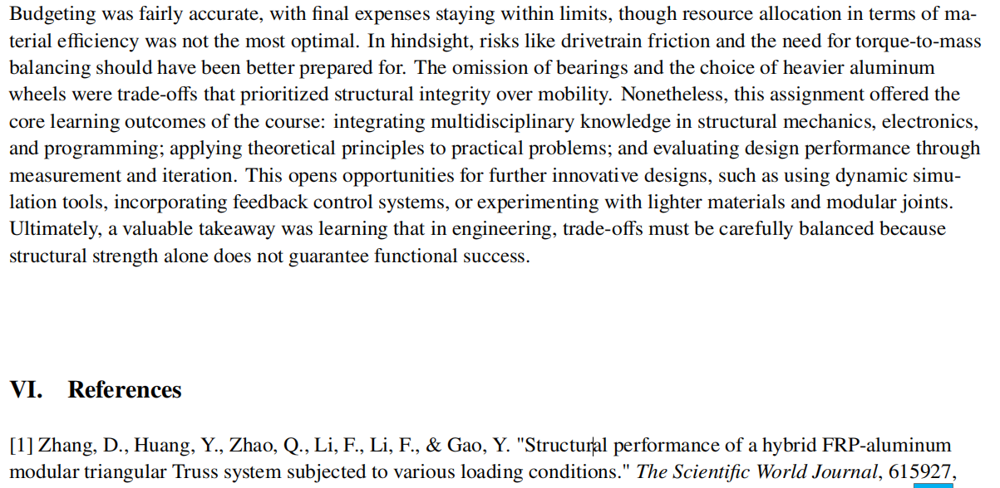

### 2. 请访问 [Reference Guide](https://aiaa.org/publications/journals/reference-style-and-format/) 获取引用格式信息

### 3. 错误案例分析

---

1. 错误点：
	 - 应该用`and`而不是`&`
	 - 文字标题错误，按照原文应该大写
	 - 标题后应该是`,`而不是`.`
	 - `615927`缺少前缀

改正：

---

2. 错误点：
	- 人名缺少`,`和`.`
	- 最后一个人名应该用`and`
	- 最后一个人名后应该用`,`
	- 标题后应该是`,`而不是`.`
	- 期刊名后应该是`,`而不是`.`
	- volume和number应该大写`Vol.`，`No.`

改正：

---

3. 错误点：
	- 人名应该完整，有姓和名
	- Reference部分不应该用`et al.`
	- **使用中文文献**，这是一个不好的习惯

改正：

---

4. 错误点：
	- 人名缺少`,`和`.`
	- 最后一个人名应该用`and`
	- 最后一个人名后应该用`,`
	- 标题后应该是`,`而不是`.`
	- 期刊名后应该是`,`而不是`.`
	- volume和number应该大写`Vol.`，`No.`

改正：

---

5. 错误点：
	- 应该用`and`而不是`&`
	- 标题后应该是`,`而不是`.`
	- volume和number应该大写`Vol.`，`No.`
改正：

---
## Note：
1. 如果你对如何规范使用$LaTeX$感到疑惑，你可以参考AIAA官方的$LaTeX$[模板](https://www.overleaf.com/latex/templates/latex-template-for-the-preparation-of-papers-for-aiaa-technical-journals/mqqbqqvyhtwm#.WbKsbsiGNPY)，你可以参考里面图片，表格，公式，参考文献的格式，并学习一些基本的用语规范和各个部分内容的要求。但由于它与我们的report模板有一些差异，请以我们的模板为准。
2. 如果你有任何关于格式，用语等各个方面的问题，你都可以访问[AIAA Journal Author Guidelines](https://www.aiaa.org/publications/journals/Journal-Author)来获取你所需要的解答。若网站上的描述与课程描述存在差异，你可以询问Teaching 