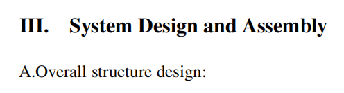

# ENGR1000J-S2 Report Format Guide

This guide summarizes common errors and point deductions in the 2025SU Phase1 report, and clarifies a series of standards when using the $LaTeX$ template.

## Part 1: Basic Requirements

### 1. Body text should be justified

$LaTeX$: The template defaults to justified alignment, no deliberate adjustment needed

- Correct example:

- Incorrect example:

  
### 2. Footnotes should be consistent with the main text

$LaTeX$: First page footnotes need to be adjusted in the `engr1000j-s2.cls` file, subsequent footnotes should be directly marked after figures and tables

- Incorrect example: When ${}^2$ and ${}^{*}$ do not appear in the main text but are noted in footnotes 

 

 

### 3. Do not leave a single word on the last line of a paragraph

- Incorrect example:

### 4. Do not leave a single line on the second page

- Incorrect example:

### 5. Page numbers should correspond to the total number of pages in the article

$LaTeX$: Needs to be adjusted in the `engr1000j-s2.cls` file

- Incorrect example:
 

### 6. Do not leave large blank spaces at the end of a page

- Incorrect example:

### 7. Do not insert consecutive figures and tables

- Figures and tables should be preceded and followed by textual explanations; charts are only meant to assist the expression of the main text
- If absolutely necessary to place two figures (or tables) consecutively, there should be normal spacing between them
- Allowed: Figures or tables can be placed on the page before or after where they are mentioned in the text
- Recommendation: Figures are recommended to be placed at the top of a page, tables at the bottom of a page
- Incorrect example:

### 8. Bullet point expressions should be concise

$LaTeX$: At the end of each item, `\\` is needed for forced line break

- When using item for bullet point expression, each point should contain no more than one complete sentence
- Incorrect example:

Correction: Use `\subsection{}`

### 9. All figures, tables, equations, and references need to be cited

$LaTeX$: Use `ref{}` to cite figures and tables, use `\eqref{}` to cite equations, use `\cite{}` to cite references

- In the main text, figures should be written as `Fig. X`, tables as `Table X`, equations as `Eq. (X)`
- Please note the space between numbers and text
- Reference citations are detailed later

### 10. All citations and links should work properly

- Figure, table, equation, and reference citation links should work properly in the final submission
- Table of contents links should work properly
- URLs or DOIs in references should work properly

---
## Part 2: Headings

### 1. Subheadings are not recommended
In fact, you will hardly need to use subheadings in this course's report

$LaTeX$: If you want to use subheadings, please use `\subsection{}`, `\subsubsection{}` directly

- Correct example:

- Incorrect example:

### 2. Do not use items as subheadings

- Distinction: Subheadings represent the beginning of new content blocks, bullet points represent enumeration
- 

---
## Part 3: Spacing

### 1. Inconsistent line spacing

- Incorrect example:

### 2. Inconsistent paragraph spacing

- Incorrect example:

### 3. Inconsistent section spacing

- Incorrect example:

### 4. Inconsistent spacing between headings and body text

- Incorrect example:

### 5. Inconsistent spacing between figure/table captions and body text

- Incorrect example:

### 6. Inconsistent spacing between text top and header on each page
 
 - Incorrect example:

 
### 7. Inconsistent spacing between text bottom and footer on each page

- Incorrect example:

### 8. Inconsistent spacing between equations and body text

- Incorrect example:

---
## Part 4: Figures

### Figure captions must end with a period

- Incorrect example:

### Figure caption format (Fig.X &emsp; Caption)

- Incorrect example:

---

## Part 5: Tables

---

## Part 6: References

### 1. References should use **9-point font**

- Incorrect example:

### 2. Please visit [Reference Guide](https://aiaa.org/publications/journals/reference-style-and-format/) for citation format information

### 3. Error case analysis

---

1. Error points:
	 - Should use `and` instead of `&`
	 - Article title error, should be capitalized according to the original text
	 - Should use `,` instead of `.` after the title
	 - `615927` lacks prefix

Correction:

---

2. Error points:
	- Names missing `,` and `.`
	- Last name should use `and`
	- Should use `,` after the last name
	- Should use `,` instead of `.` after the title
	- Should use `,` instead of `.` after journal name
	- Volume and number should be capitalized as `Vol.`, `No.`

Correction:

---

3. Error points:
	- Names should be complete, with both surname and given name
	- Reference section should not use `et al.`
	- **Using Chinese literature** is a bad practice

Correction:

---

4. Error points:
	- Names missing `,` and `.`
	- Last name should use `and`
	- Should use `,` after the last name
	- Should use `,` instead of `.` after the title
	- Should use `,` instead of `.` after journal name
	- Volume and number should be capitalized as `Vol.`, `No.`

Correction:

---

5. Error points:
	- Should use `and` instead of `&`
	- Should use `,` instead of `.` after the title
	- Volume and number should be capitalized as `Vol.`, `No.`
Correction:

---
## Note:
1. If you are confused about how to use $LaTeX$ properly, you can refer to the official AIAA $LaTeX$ [template](https://www.overleaf.com/latex/templates/latex-template-for-the-preparation-of-papers-for-aiaa-technical-journals/mqqbqqvyhtwm#.WbKsbsiGNPY). You can refer to the formats of figures, tables, equations, and references, and learn basic language standards and requirements for each section. However, since it differs from our report template, please follow our template as the standard.
2. If you have any questions about formatting, language, or other aspects, you can visit [AIAA Journal Author Guidelines](https://www.aiaa.org/publications/journals/Journal-Author) to get the answers you need. If there are differences between the website descriptions and course descriptions, you can ask the Teaching staff. 